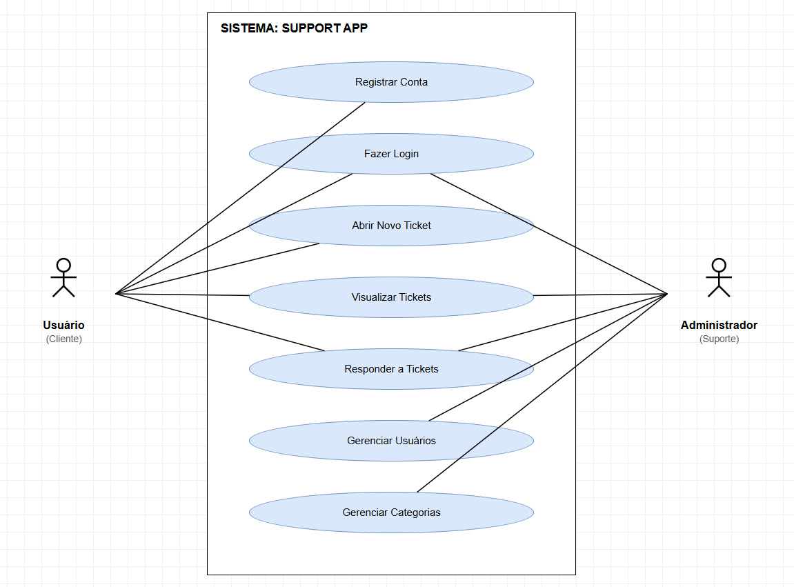
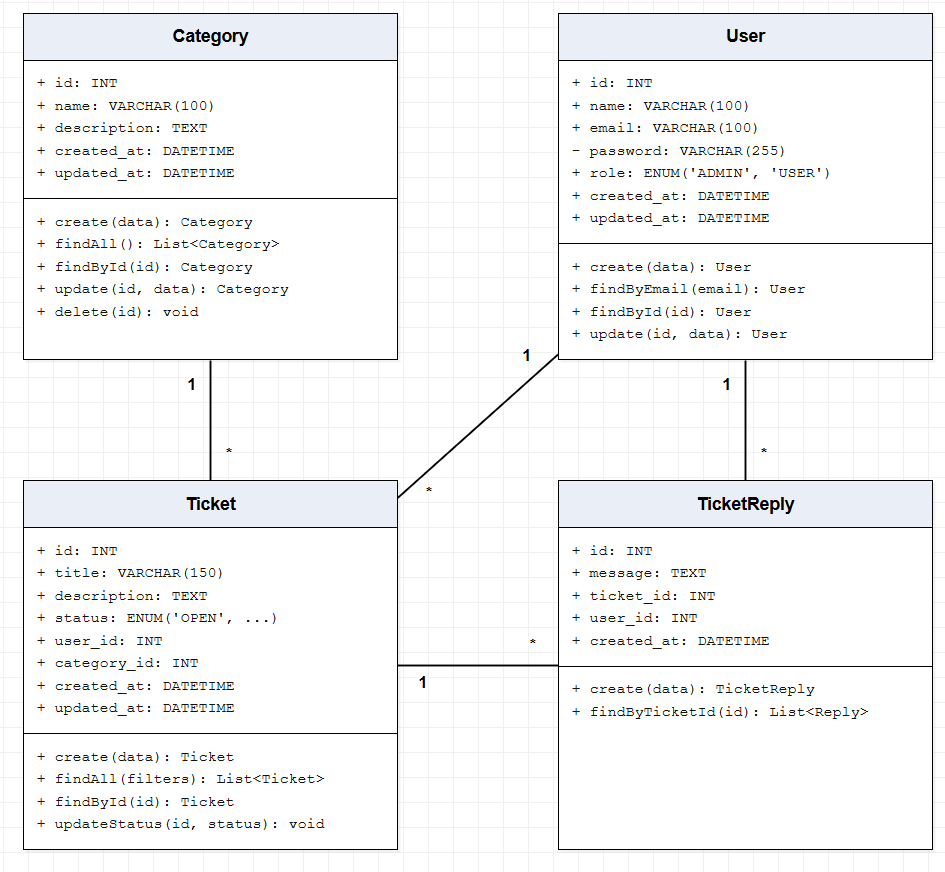

# DeskPro - Sistema de Suporte (Help Desk)

O **DeskPro** é um sistema de tickets onde usuários podem enviar mensagens para o suporte técnico, acompanhar suas solicitações e interagir com os atendimentos. Conta também com um painel administrativo para gerenciar usuários, categorias e todos os tickets do sistema.

> Projeto desenvolvido a partir de uma atividade passada pelo professor de **Análise e Desenvolvimento de Sistemas (ADS)**.

## Stack

- **Backend:** Node.js 22, Express 5, TypeScript, WebSocket, JWT
- **Frontend:** React 19, TypeScript, Vite, Tailwind CSS 4, React Router 7
- **Banco:** MySQL 8.0
- **Infra:** Docker Compose

## Como rodar

Escolha uma das alternativas abaixo.

---

### Alternativa 1 — Docker (recomendado) 🐳

Com Docker você sobe tudo (backend, frontend e banco) com um comando.

**Pré-requisitos:** [Docker](https://docs.docker.com/get-docker/) e [Docker Compose](https://docs.docker.com/compose/install/).

```bash
docker-compose up --build
```

Acesse o frontend em **http://localhost:5173**.

> O banco já vem com um admin setado. Use as credenciais da seção abaixo.

---

### Alternativa 2 — Manual (sem Docker)

Você precisa ter **Node.js 22+** e **MySQL 8.0** instalados.

**1. Configure o banco MySQL**

Execute o script `mysql/database.sql` em sua instância MySQL para criar as tabelas e o admin padrão.

**2. Configure as variáveis de ambiente**

```bash
cp backend/.env.example backend/.env
```

Edite `backend/.env` com suas credenciais MySQL e preencha um `JWT_SECRET` (qualquer string).

**3. Suba o backend**

```bash
cd backend
npm install
npm run dev
```

**4. Suba o frontend**

```bash
cd frontend
npm install
npm run dev
```

O backend roda em **http://localhost:3000** e o frontend em **http://localhost:5173**.

## Credenciais padrão

| Tipo  | E-mail            | Senha  |
|-------|-------------------|--------|
| Admin | admin@admin.com   | 123456 |

## Diagramas

### Caso de Uso



### Diagrama de Classes



| Tipo  | E-mail          | Senha     |
| ----- | --------------- | --------- |
| Admin | admin@admin.com | Admin@123 |

## Estrutura

```
├── backend/          # API REST + WebSocket
│   └── src/
│       ├── controllers/
│       ├── services/
│       ├── repositories/
│       └── middlewares/
├── frontend/         # SPA React
│   └── src/
│       ├── components/
│       ├── pages/
│       ├── services/
│       └── contexts/
└── mysql/            # Schema + seed
```

## Scripts disponíveis

### Backend

| Comando         | Descrição                        |
| --------------- | -------------------------------- |
| `npm run dev`   | Dev server com hot reload        |
| `npm run build` | Compila TypeScript para `./dist` |
| `npm run start` | Roda o build de produção         |

### Frontend

| Comando           | Descrição                    |
| ----------------- | ---------------------------- |
| `npm run dev`     | Dev server Vite              |
| `npm run build`   | Build de produção            |
| `npm run preview` | Preview do build de produção |
| `npm run lint`    | Executa ESLint               |
